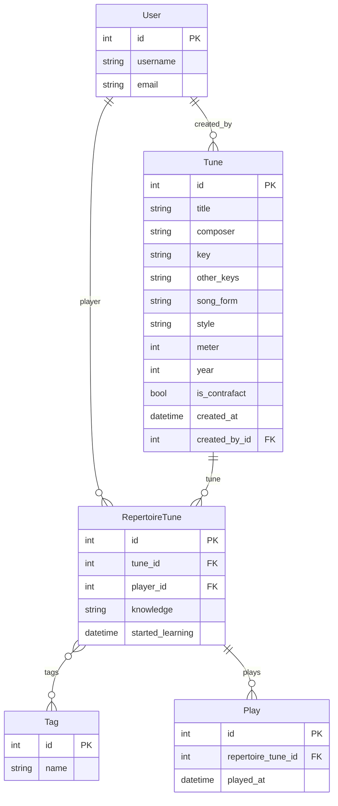

# jazztunes - a jazz repertoire management app
[](https://github.com/jwjacobson/jazztunes/actions)
[](https://jazztunes.readthedocs.io/en/latest/)
[](https://www.python.org/)
[](https://www.djangoproject.com/)
[](https://github.com/astral-sh/uv)
[](https://github.com/astral-sh/ruff)
[](https://www.gnu.org/licenses/gpl-3.0)

Jazztunes is a web app that helps jazz musicians manage and gain insights into their repertoires. To use it, go to [jazztunes.org](https://jazztunes.org/).

This readme focuses on technical aspects of the app of interest to developers; if you want to learn how to use jazztunes, see the [user manual](https://jazztunes.readthedocs.io/en/).

### Tech stack
Jazztunes is a full-stack web app built using [Django 6](https://www.djangoproject.com/) on the back end and [htmx](https://htmx.org/) on the front end with [Tailwind CSS](https://tailwindcss.com/) for styling. The database is [PostgreSQL](https://www.postgresql.org/). Tables are implemented with [DataTables](https://datatables.net/) for clickable column sorting. Tests are written in [pytest](https://docs.pytest.org/en/8.2.x/) and [Playwright](https://playwright.dev/python/docs/intro). The deployed version uses Python 3.14.

### Database structure

In jazztunes, a user creates **Tunes**, which contain 'objective' musical information like composer, key, and form. When a Tune is added to a user's repertoire, an associated **RepertoireTune** is created, which holds user-specific tune information: their knowledge of it, their **Plays** (which track when and how many times a Tune is played), and any **Tags** (musical info that may vary from player to player, like tempo and feel). Users can sort their repertoire by last played for an instant historical overview, and the app provides analytics based on their Plays. 

### Local installation
Follow these instructions if you want to run jazztunes locally or develop it. Otherwise, the easiest way to use it is at [jazztunes.org](https://jazztunes.org/).

*Prerequisite*: [Install uv](https://docs.astral.sh/uv/getting-started/installation/)

Clone this repository (example uses ssh) and navigate to the `jazztunes` directory:
```bash
git clone git@github.com:jwjacobson/jazztunes.git; cd jazztunes
```
Create a `.env` file (`env-template` contains reasonable defaults):
```bash
cp env-template .env
```
Set up the database:
```bash
uv run python manage.py migrate
```
If you want to use the Public tune feature, you'll need to first create a superuser: 
```bash
uv run python manage.py createsuperuser
```
 then set that user's ID to ADMIN_USER_ID in `.env` (it will be 1 if it's the first user created, otherwise 2, etc.).
 
 Tunes you create as the superuser will show up on the Public page for all other users. Creating a superuser is also a good idea because it gives you access to the [Django admin](https://docs.djangoproject.com/en/6.0/ref/contrib/admin/) interface.
 
Start the server:

```bash
uv run python manage.py runserver
```

Ctrl-click on ```http://127.0.0.1:8000``` — This will open jazztunes in your default browser. You can also just navigate to that address in a browser.

You can close the app by pressing `Ctrl-C` in the terminal running the server.

### Setting up demo user + tunes
*Prerequisite*: complete local installation, including superuser

Jazztunes includes a fixture of tunes from the live app's admin user, along with management commands to import them and generate a realistic test user.

First, import the admin tunes from the included fixture:
```bash
uv run python manage.py import_admin_tunes
```

Then create a test user with a generated repertoire and play history:
```bash
uv run python manage.py create_test_user
```

This creates a user `miles` (password: `password`) with 100 tunes and a year's worth of play history, distributed realistically across heavy rotation, occasional plays, and never-played tunes. You can customize the username, tune count, and date range:
```bash
uv run python manage.py create_test_user --username trane --num-tunes 50 --days 180
```

The test user is useful for developing and manually testing the analytics features, which require meaningful play history to be interesting, or to just get a feel for the app without having to set up a repertoire first.

### Running the tests
Jazztunes includes unit tests written in [pytest](https://docs.pytest.org/en/stable/) and end-to-end tests which use [Playwright](https://playwright.dev/python/docs/intro). If you are contributing to Jazztunes, please (1) run the tests, to make sure your contributions don't break anything; and (2) write tests covering your contribution, if applicable. Or perhaps you'd just like to contribute some tests! Tests can be found in the `tests` directory at the root of the project.

Run all the tests:
```bash
uv run pytest
```

Run only the unit tests:
```bash
uv run pytest -k unit
```
Note: the `-k` option can be used to match any pattern in directory, file, or test names!

Run the tests in "headed" mode (for end-to-end tests only -- a browser will open and you can watch it go through the steps):
```bash
uv run pytest -k e2e --headed
```

See the respective docs for many more options when running tests.


### License
Jazztunes is [free software](https://www.fsf.org/about/what-is-free-software), released under version 3.0 of the GPL. Everyone has the right to use, modify, and distribute jazztunes subject to the [stipulations](https://github.com/jwjacobson/jazztunes/blob/main/LICENSE) of that license.
